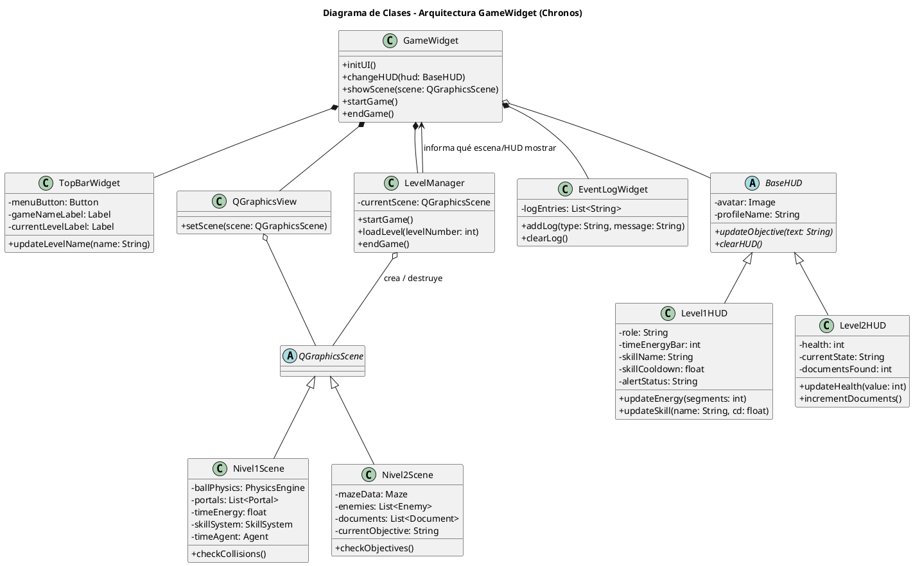

```plantuml
@startuml
skinparam classAttributeIconSize 0
title Diagrama de Clases - Arquitectura GameWidget (Chronos)

' --- Clases de Interfaz (Viven siempre) ---
class GameWidget {
    + initUI()
    + changeHUD(hud: BaseHUD)
    + showScene(scene: QGraphicsScene)
    + startGame()
    + endGame()
}

class TopBarWidget {
    - menuButton: Button
    - gameNameLabel: Label
    - currentLevelLabel: Label
    + updateLevelName(name: String)
}

class QGraphicsView {
    + setScene(scene: QGraphicsScene)
}

class EventLogWidget {
    - logEntries: List<String>
    + addLog(type: String, message: String)
    + clearLog()
}

' --- Jerarquía de HUDs ---
abstract class BaseHUD {
    - avatar: Image
    - profileName: String
    + {abstract} updateObjective(text: String)
    + {abstract} clearHUD()
}

class Level1HUD {
    - role: String
    - timeEnergyBar: int
    - skillName: String
    - skillCooldown: float
    - alertStatus: String
    + updateEnergy(segments: int)
    + updateSkill(name: String, cd: float)
}

class Level2HUD {
    - health: int
    - currentState: String
    - documentsFound: int
    + updateHealth(value: int)
    + incrementDocuments()
}

' --- Controlador del Ciclo de Vida ---
class LevelManager {
    - currentScene: QGraphicsScene
    + startGame()
    + loadLevel(levelNumber: int)
    + endGame()
}

' --- Jerarquía de Escenas (Se crean/destruyen) ---
abstract class QGraphicsScene {
}

class Nivel1Scene {
    - ballPhysics: PhysicsEngine
    - portals: List<Portal>
    - timeEnergy: float
    - skillSystem: SkillSystem
    - timeAgent: Agent
    + checkCollisions()
}

class Nivel2Scene {
    - mazeData: Maze
    - enemies: List<Enemy>
    - documents: List<Document>
    - currentObjective: String
    + checkObjectives()
}

' --- Relaciones y Composición ---
GameWidget *-- TopBarWidget
GameWidget *-- QGraphicsView
GameWidget *-- EventLogWidget
GameWidget *-- LevelManager
GameWidget o-- BaseHUD

BaseHUD <|-- Level1HUD
BaseHUD <|-- Level2HUD

QGraphicsView o-- QGraphicsScene
QGraphicsScene <|-- Nivel1Scene
QGraphicsScene <|-- Nivel2Scene

LevelManager --> GameWidget : "informa qué escena/HUD mostrar"
LevelManager o-- QGraphicsScene : "crea / destruye"

@enduml


```