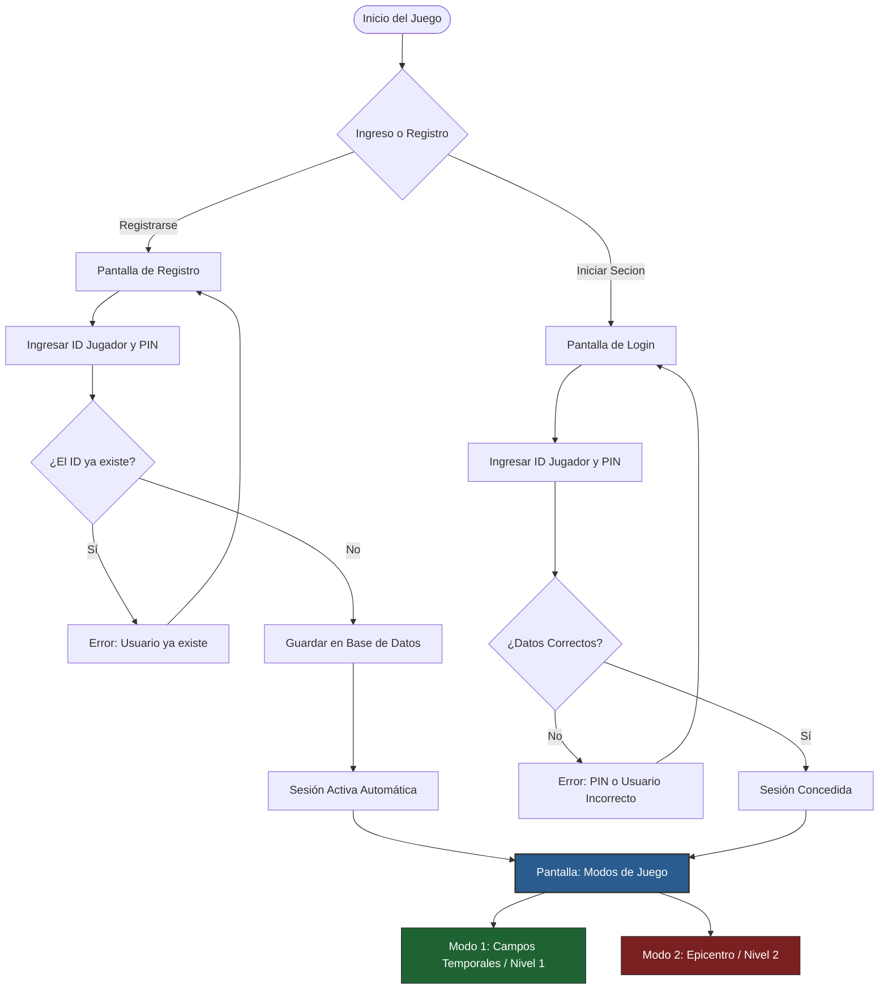

# Sistema de Autenticación y Gestión de Viajeros

## 1. El Registro en el Nexo Temporal

> Para que **Chronoa** pueda registrar los descubrimientos sobre la barrera temporal y asegurar que sus saltos cronológicos queden guardados en la línea de tiempo correcta, el sistema requiere una firma de identidad única. Cada anomalía superada, cada documento recuperado en el epicentro y cada registro de sus habilidades se asocian de manera inequívoca a su perfil de viajero. Sin esta sincronización en el Nexo, el progreso a través de los fragmentos del tiempo se perdería en el vacío del caos espacio-temporal.

## 2. ¿Qué información guardamos en el Nexo? (Base de Datos)

Cuando juegas y avanzas en la historia, el juego necesita recordar con precisión quién eres y qué has logrado. En lugar de guardar archivos sueltos, organizamos todo en tres grandes carpetas de información:

- **Jugador:** Es la tarjeta de identidad del usuario. Aquí guardamos su nombre de viajero (ID) y un PIN secreto para que nadie más entre a su cuenta. Además, es donde controlamos cuántas vidas globales le quedan (por defecto empieza con 5) y la puntuación total que ha acumulado a lo largo de toda su aventura.
    
- **Progreso del Modo 1 (Campos Temporales / Minigolf):** Esta carpeta anota cómo le fue al jugador esquivando anomalías en los exteriores. Guarda cuántos golpes necesitó para meter la pelota en la bandera, los segundos exactos que tardó en superar el mapa y si logró completarlo con éxito.
    
- **Progreso del Modo 2 (Epicentro / Laberinto):** Aquí registramos las hazañas de Chronoa dentro de las ruinas del laboratorio científico. El sistema apunta cuántos documentos históricos logró rescatar de los agentes de la IA, cuánto tiempo sobrevivió en los pasillos y si completó el objetivo del nivel.
    

### El toque técnico: Asegurando que el tiempo no se rompa

Para que todo esto funcione tras bambalinas, el juego crea de forma automática un archivo llamado `cronos_data.sqlite` en la carpeta de almacenamiento de la aplicación.

Para evitar errores extraños (como que existan datos de partidas sin que pertenezcan a ningún jugador), la base de datos tiene activadas las restricciones de claves foráneas (`PRAGMA foreign_keys = ON`) y una regla de limpieza automática conocida como `ON DELETE CASCADE`. Esto significa que si decides borrar el perfil de un jugador, el sistema limpiará inmediatamente todo su historial de golpes, tiempos y documentos recolectados en ambos modos de juego, evitando dejar datos basura flotando en la memoria.

## 3. Flujo de Acceso y Selección de Misión

El proceso para entrar al universo de Chronos es directo: el usuario interactúa con la interfaz para registrarse por primera vez o para iniciar sesión si ya tiene un perfil guardado. Tras pasar la validación del gestor de datos, el sistema concede el acceso y redirige de inmediato a la interfaz principal de **Modos de Juego**.

El siguiente diagrama muestra cómo la autenticación abre el camino hacia las dos realidades del juego:

