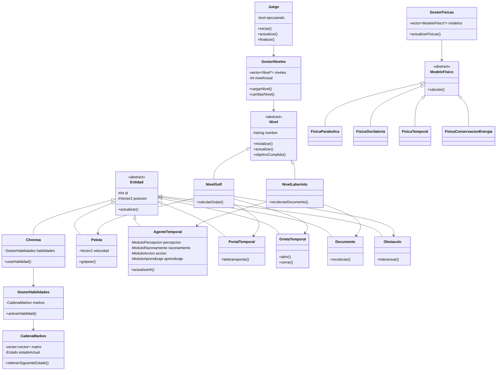
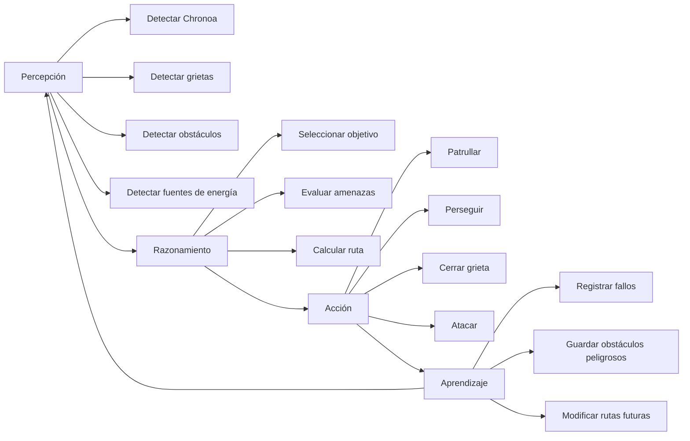

## Descripción detallada de las vistas

Estas vista fueron descritas de forma detallada en el [momento 1](momento-1.md). Es una descripción muy completa. Con el fin de cumplir los [requisitos](requisitos-udea.md), y aclarar la vista del juego, se agrega a continuación dibujos informales hechos en excalidraw, con el fin de complementar la transparencia de este proyecto, dejare los ficheros .excalidraw editables en la rama chore, de este proyecto, pero dejaré a continuación el 
## Dibujo de las vistas

### Nivel 1

Nota: La vista anterior no contiene la pre-visualización completa del nivel, ya que faltan elementos, como, péndulos, grietas, y el mismo agente que será añadido en el juego.

### Nivel 2

==PENDIENTE==

## Diagrama de clases con nivel

## Diagrama de flujo y descripción agente IA

