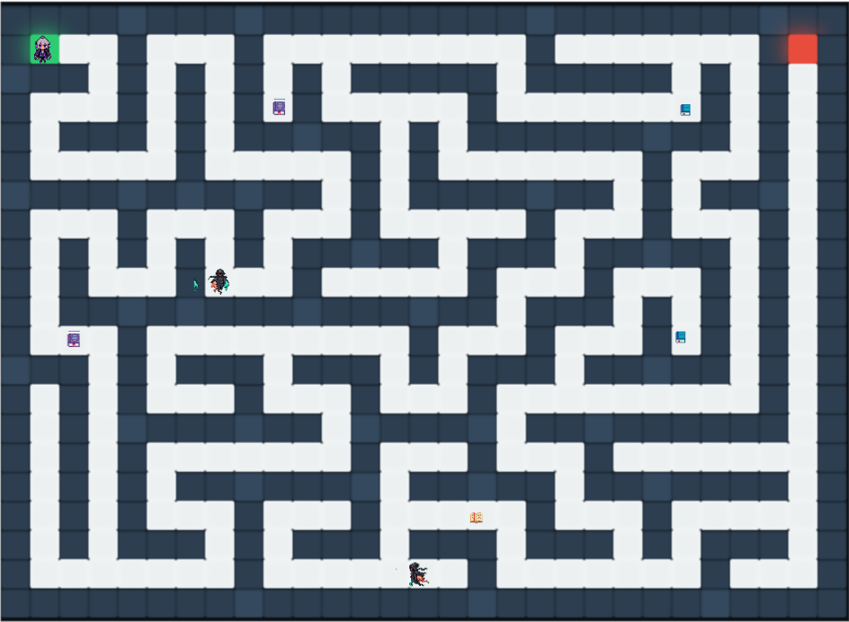
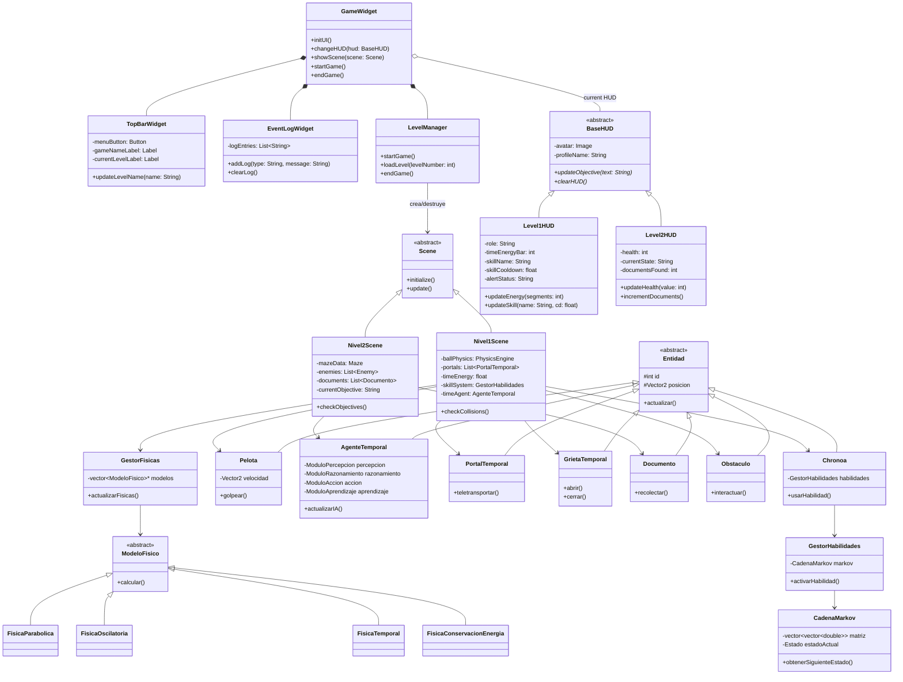
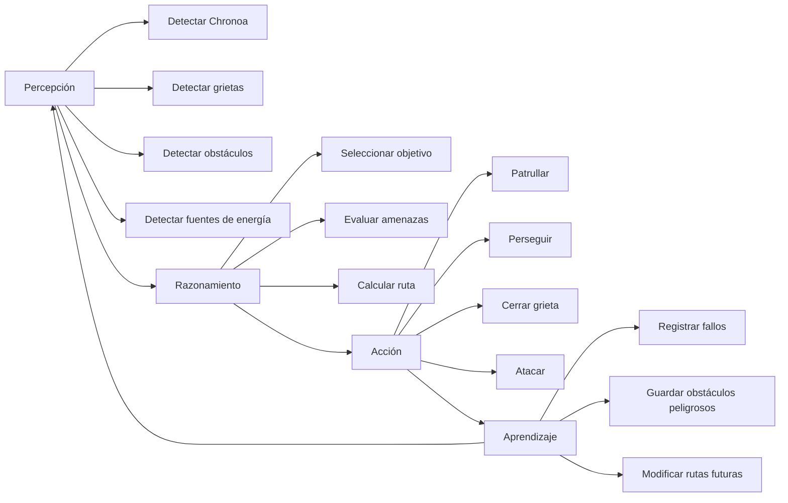
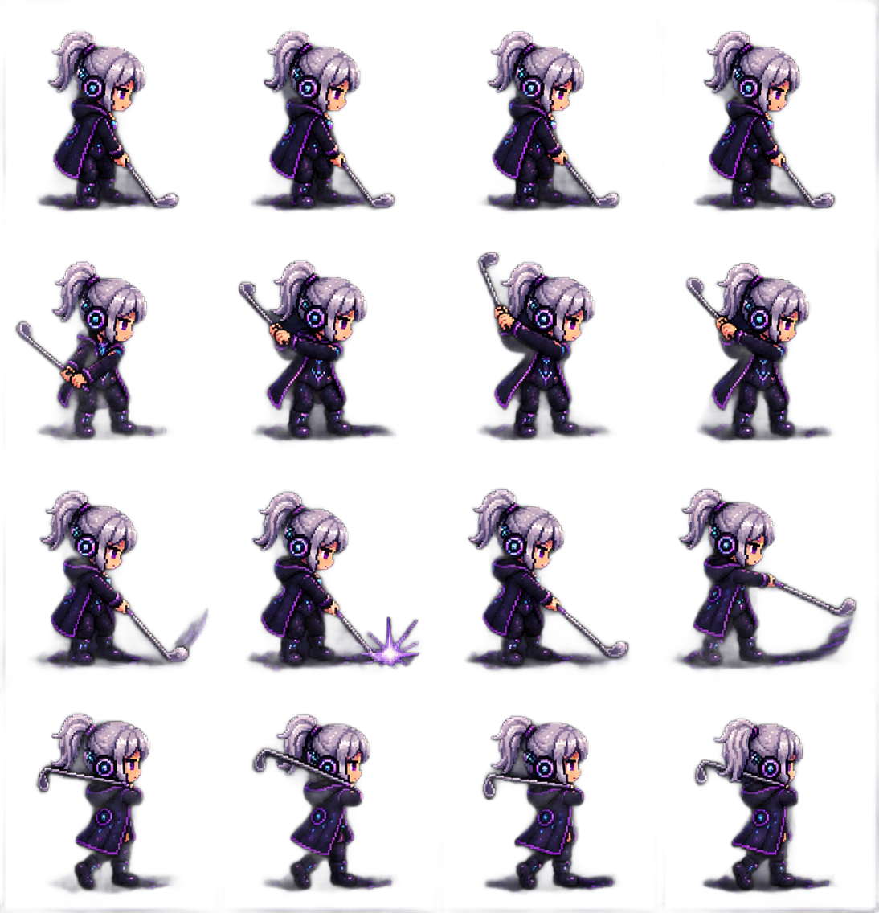
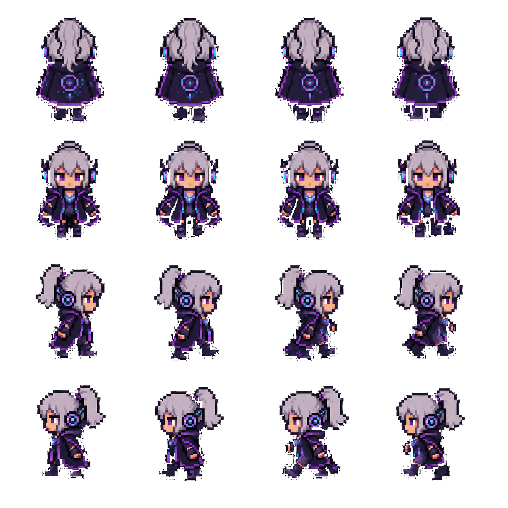
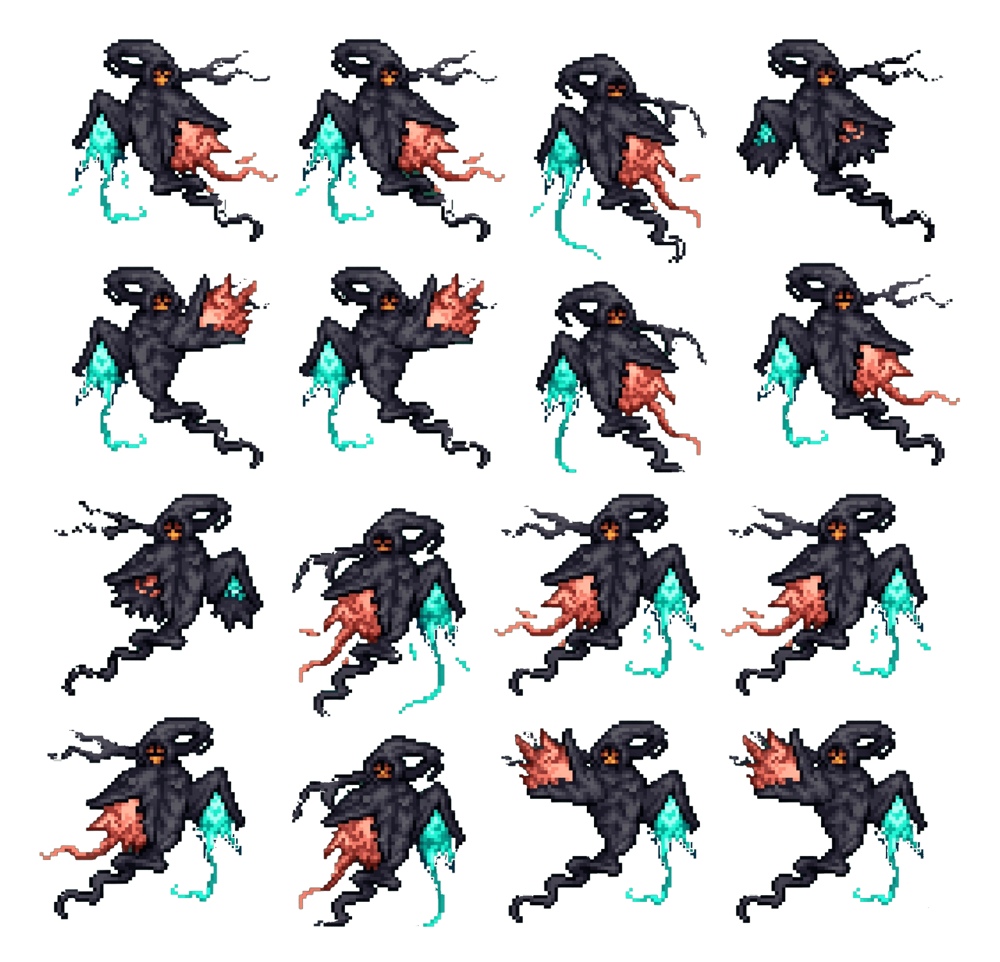
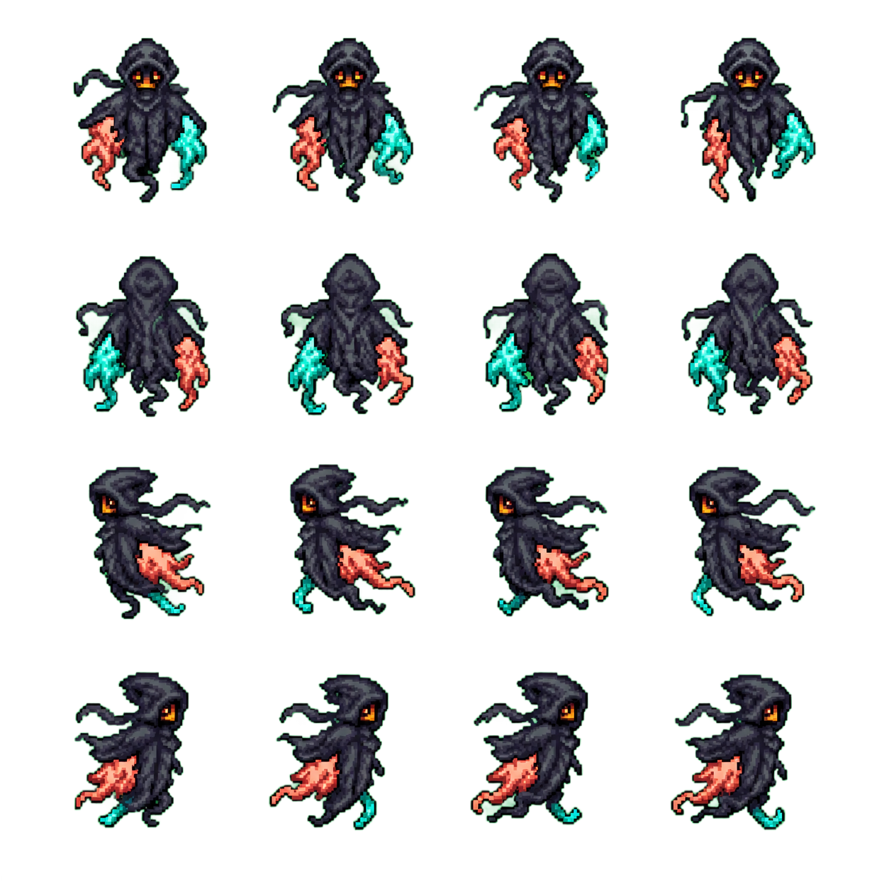

## Descripción detallada de las vistas

Estas vista fueron descritas de forma detallada en el [momento 1](momento-1.md). Es una descripción muy completa. Con el fin de cumplir los [requisitos](requisitos-udea.md), y aclarar la vista del juego, se agrega a continuación dibujos informales hechos en excalidraw, con el fin de complementar la transparencia de este proyecto, dejare los ficheros .excalidraw editables en la rama chore, de este proyecto, pero dejaré a continuación el 
## Dibujo de las vistas

### Nivel 1

Nota: La vista anterior no contiene la pre-visualización completa del nivel, ya que faltan elementos, como, péndulos, grietas, y el mismo agente que será añadido en el juego.

>[!NOTE]
> Esta imagen de concepto recibirá una actualización, con el fin mostrar mas fidelidad visual.

### Nivel 2

## Diagrama de clases con nivel

## Diagrama de flujo y descripción agente IA

## Sprites usados

> [!IMPORTANT]
> Los sprites están siendo creados o recolectados en la actualidad por lo que puede faltar alguno que no se ha contemplado a la fecha

### Personaje Chronoa Obert

#### Sprite de bateo

#### Pixel art para laberinto

### Agente IA

#### Agente cerrando grieta 

#### Pixel art para laberinto

---

> [!WARNING]
> Hay correcciones visuales pendientes, sin embargo, a la fecha no tienen pronosticada una corrección, esto debido a un limitante en habilidades de diseño gráfico.

---

## Formulas para las físicas

> [!NOTE]
> **Notas del autor:** Durante la búsqueda de la ecuación de un péndulo simple, me encontré con vídeos, muy interesantes que tratan el movimiento pendular como una ecuacion diferencial.

Entre los vídeos que vi, encontré este: 
 
 - [Pendulo - Mates Mike](https://www.youtube.com/watch?v=y5B6FCJlK9M)

---

>[!IMPORTANT]
>En este punto debo resaltar que, este proyecto es una versión simplificada de un proyecto universitario, que aunque no se pudo materializar por completo con plazo que se dio, *replico por esto* ultimo; el proyecto universitario es lo que rige las leyes de desarrollo de este proyecto. En el mismo lo que se le puede llamar **la idea original** del proyecto fue producto de trabajo equipo con mi estimada compañera **Nataly Orozco**.

---

Ahora continuando con lo que venía narrando sobre **las físicas** y en relación con lo anterior, la **idea original** contiene péndulos, y una variedad de cosas nada menos que *fenómenos complejos del mundo*, y he descartado el implementarla en su totalidad, sin embargo, es a falta de las formulas que rigen los comportamientos físicos de nuestro mundo. no encontraba la forma de plantear estos fenómenos, ya que la idea formada requerían cálculos costosos y había que condicionadles a eventos, por lo que la carga de procesamiento y la gestión de todos estos fenómenos en cada instante del juego, se percibe surrealista. Pero **GLORIA SEAN DADAS A DIOS**, quien inspiró a este su siervo, con una idea que describiré a continuación:

> _"El mundo 2D percibe fenómenos lineales de nuestro mundo 3D como ecuaciones diferenciales"_.

Esto último implica que un sistema diferencial (que describe cambios y tendencias) se puede transformar en un sistema geométrico contenido y estructurado dentro de un espacio vectorial, cuyo nombre según investigación rápida "**(espacio de fases)**".

Les adjunto un vídeo de referencia:

- [Vectores en un espacio abstracto - 3Blue1Brown Español](https://www.youtube.com/watch?v=dZ4oM9bGI1s&t=6s)

Dejo la investigación detallada a el criterio y curiosidad del lector, en cuanto a la documentación del proyecto, plantearé el concepto como base y ajuntare resultados de investigación informal de manera preliminar, intentaré dejar simuladores para facilitar la compresión de la sistema planteado.

- [Sistema del Péndulo 2D en el Plano Vertical X-Y](docs/investigacion-preliminar/pendulo-transformacion-lineal-afín)