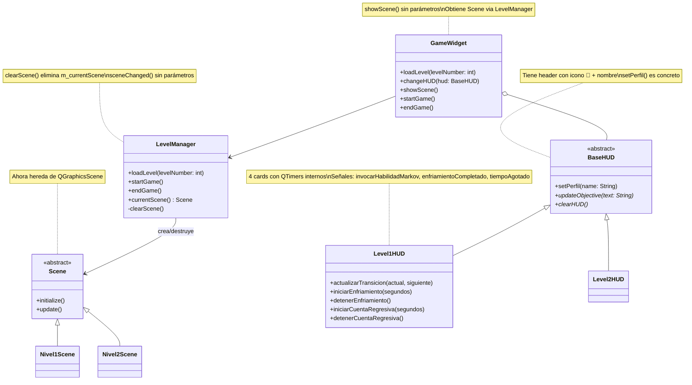

## Lista de tareas previas
- [x] Crear interface GameWidget completa
- [x] Implementar LevelManager con gestión de ciclo de vida de escenas
- [x] Clase abstracta Scene (hereda QGraphicsScene)
- [x] TopBarWidget funcional (volver, nombre juego, nivel actual)
- [x] BaseHUD abstracto + header de perfil (icono + nombre)
- [x] Level1HUD con 4 cards funcionales (invocar, tabla, enfriamiento, cuenta regresiva)
- [x] Level2HUD con barra de progreso
- [x] Limpieza automática de escena al salir de GameWidget
---
## Que hay de nuevo?

1. Se implementó por la interfaz del widget del juego (`GameWidget`) y todo su sistema de subclases.

2. El `LevelManager` ahora gestiona la creación y eliminación de escenas: al cargar un nivel se elimina la escena anterior, al salir del juego se elimina la escena actual

> 	La limpieza se dispara tanto por el botón "Volver" como automáticamente al navegar fuera de la página `GameWidget` mediante `QStackedWidget::currentChanged`.

---

## Actualizaciones pendientes al diagrama de clase (momento2.md)

Los siguientes cambios respecto al diagrama original de `docs/momento-2.md` no están reflejados aún:

---

## Lista de tareas de primera prioridad

- [ ] Crear rama CHORE para almacenar ficheros .excalidraw

> [!IMPORTANT]
> SERÁN CARGADOS EN CUANTO SE TENGA UNA VERSIÓN ESTABLE Y NO SUJETA A MODIFICACIONES, DE CADA FICHERO.

- [ ] Nivel 1 (Campos Temporales): escena con física de péndulo, portales, grietas y agente IA
- [ ] Nivel 2 (El Epicentro): escena de laberinto con recolección de documentos y agente IA
- [ ] Pagina para almacenar los simuladores para las físicas